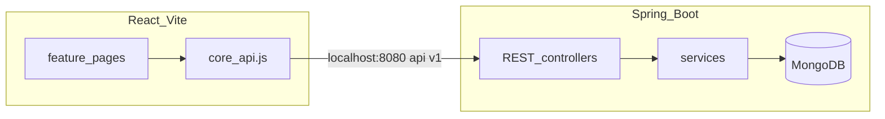

# Running the MVP and how teammates plug in

## See it running live

You need **MongoDB** (see [MONGODB_SETUP.md](MONGODB_SETUP.md)), **`application-local.properties`** with your Atlas URI (gitignored), and the **`local` Spring profile** when running the backend.

**Terminal 1 — backend** (from repo root):

```bash
cd backend
./mvnw spring-boot:run -Dspring-boot.run.profiles=local
```

Wait until you see **Tomcat started on port 8080** and **Started SmartCampusBackendApplication**. The log should show **`The following 1 profile is active: "local"`**.

**Terminal 2 — frontend:**

```bash
cd frontend
npm install   # first time only
npm run dev
```

**Browser:** open the URL Vite prints (usually **http://localhost:5173**). You should see the dashboard shell, nav links, and pages for Resources, Bookings, Tickets, Login.

**Quick API check** (optional, third terminal):

```bash
curl -s http://localhost:8080/api/v1/users
```

---

## What is implemented already (one monorepo, not separate silos)

The app is **one** Spring Boot API under **`/api/v1`** and **one** React SPA. Auth, notifications, core (exceptions, CORS, security seeding), facilities, bookings, and maintenance live in the **same** codebase — same server, same axios `baseURL` in `frontend/src/features/core/api.js`.

### Frontend routes (`frontend/src/features/core/App.jsx`)

| Path | Owner area | Purpose |
|------|------------|---------|
| `/` | core | Dashboard |
| `/login` | auth | Login placeholder (OAuth later) |
| `/resources` | facilities | Resource catalogue UI |
| `/bookings` | bookings | Bookings UI |
| `/tickets` | maintenance | Tickets UI |

Nav + **AuthContext** (Admin view dev toggle) + **NotificationDropdown** live in `frontend/src/features/core/Layout.jsx`.

### Backend REST surface (all under `/api/v1`)

- **Users:** `GET /users`, `GET /users/{id}` — `backend/src/main/java/com/smartcampus/auth/UserController.java`
- **Notifications:** `GET /notifications?userId=`, `PATCH /notifications/{id}/read` — `backend/src/main/java/com/smartcampus/notifications/NotificationController.java`
- **Resources:** `GET/POST /resources`, `GET/DELETE /resources/{id}` — `backend/src/main/java/com/smartcampus/facilities/ResourceController.java`
- **Bookings:** `GET/POST /bookings`, `PATCH /bookings/{id}/status` — `backend/src/main/java/com/smartcampus/bookings/BookingController.java`
- **Tickets:** `GET/POST /tickets`, `GET /tickets/{id}`, `PATCH /tickets/{id}/status`, `PATCH /tickets/{id}/assignment`, `POST /tickets/{id}/comments` — `backend/src/main/java/com/smartcampus/maintenance/TicketController.java`

These routes already exist; members refine logic, DTOs, validation, and UI inside their feature packages per [03-BACKEND_API_RULES.md](03-BACKEND_API_RULES.md) and [04-GIT_AND_WORKFLOW.md](04-GIT_AND_WORKFLOW.md).



---

## How other members blend in

1. **Same repo, same conventions:** Work in `backend/src/main/java/com/smartcampus/{facilities|bookings|maintenance|auth|notifications}/` and `frontend/src/features/{...}/`.
2. **Extend, do not fork:** Keep adding behavior under the same `/api/v1/...` naming rules (plural resources, PATCH for status where applicable).
3. **Cross-domain hooks:** Booking approval and ticket status updates call **NotificationService** so notifications stay in the notifications module.
4. **Danger zone** (coordinate before bulk edits): `frontend/src/features/core/App.jsx` (new `<Route>` lines), `frontend/package.json`, `backend/pom.xml`, `backend/src/main/resources/application.properties`.

**After pulling `main`:** create `feat/m1-facilities` (etc.), add your own **local-only** `application-local.properties`, run backend with **profile `local`**, run `npm run dev`, then iterate in **your** feature folders and open PRs.

See also [TEAM_HANDOFF.md](TEAM_HANDOFF.md).
