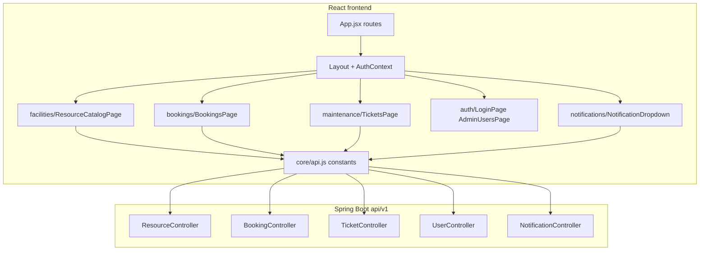

# 06 — Team ownership, file map, gaps, and improvements

This document mirrors the living architecture of the Smart Campus Hub MVP: who owns which areas, which files implement them, what is still open, and sensible next steps.

## How the app is wired (high level)

Central routing lives in `frontend/src/features/core/App.jsx`: **`/app/*`** (student) and **`/admin/*`** (staff) mount the same feature pages where possible; `AuthContext.jsx` derives **`currentUserId`** and **`isAdmin`** from whether the path starts with `/admin`. HTTP calls use `frontend/src/features/core/api.js` against `http://localhost:8080/api/v1`.

---

## Member 1 — Facilities and resources

**Responsibility:** Resource catalogue (rooms, labs, equipment) per [01-BUSINESS_AND_DATA_MODEL.md](01-BUSINESS_AND_DATA_MODEL.md).

**Backend:**

| Area | Location |
|------|----------|
| Package | `backend/src/main/java/com/smartcampus/facilities/` |
| REST | `GET/POST /api/v1/resources`, `GET /api/v1/resources/{id}`, `PATCH /api/v1/resources/{id}`, `DELETE /api/v1/resources/{id}` — `ResourceController.java` |
| Persistence | `Resource`, `ResourceRepository`, `ResourceService` |

**Frontend:**

| File | Role |
|------|------|
| `frontend/src/features/facilities/ResourceCatalogPage.jsx` | Browse vs manage (`isAdmin`); create, **edit (PATCH)**, delete. Routes: `/app/resources`, `/admin/resources`. |

**Shared touchpoints:** Bookings and tickets use `resourceId`; ticket form loads resources.

---

## Member 2 — Bookings

**Responsibility:** Booking requests, overlap rules, admin approve/reject, notifications on status change.

**Backend:**

| Area | Location |
|------|----------|
| Package | `backend/src/main/java/com/smartcampus/bookings/` |
| REST | `GET /api/v1/bookings?userId=`, `POST /api/v1/bookings`, `PATCH /api/v1/bookings/{id}/status` — `BookingController.java` |
| Logic | `BookingService.java`: time validation, active resource check, `assertNoOverlap`, `NotificationService` on approve/reject |

**Frontend:**

| File | Role |
|------|------|
| `frontend/src/features/bookings/BookingsPage.jsx` | Student: own bookings + create. Staff: all + approve/reject. `/app/bookings`, `/admin/bookings`. |

---

## Member 3 — Maintenance / incidents (tickets)

**Responsibility:** Incident reporting, images (Base64), comments, staff status and assignment; notifications.

**Backend:**

| Area | Location |
|------|----------|
| Package | `backend/src/main/java/com/smartcampus/maintenance/` |
| REST | `GET /api/v1/tickets?userId=`, `GET /api/v1/tickets/{id}`, `POST`, `PATCH .../status`, `PATCH .../assignment`, `POST .../comments` — `TicketController.java` |
| Logic | `TicketService` (uses `NotificationService`) |

**Frontend:**

| File | Role |
|------|------|
| `frontend/src/features/maintenance/TicketsPage.jsx` | `/app/report`: report form + list. `/admin/incidents`: staff console, no student form. |

---

## Member 4 — Auth, users, notifications (+ shared core UI)

**Responsibility:** Login/OAuth direction, users API, notifications; integration of the shell.

**Backend:**

| Area | Location |
|------|----------|
| Users | `UserController.java`: `GET /api/v1/users`, `GET /api/v1/users/{id}` |
| Notifications | `NotificationController.java`: `GET /api/v1/notifications?userId=`, `PATCH .../read` |
| Security | `SecurityConfig.java`: permit-all for MVP dev |
| Seeding | `DataSeeder.java` |

**Frontend:**

| File | Role |
|------|------|
| `LoginPage.jsx` | OAuth placeholder. `/login`. |
| `AdminUsersPage.jsx` | Lists users from `GET /api/v1/users`. `/admin/users`. |
| `NotificationDropdown.jsx` | Header alerts; `Layout.jsx`. |
| `UserAccountPage.jsx` | Account stub. `/app/account`. |

**Shared core:** `App.jsx`, `Layout.jsx`, `AuthContext.jsx`, `UserDashboardPage.jsx`, `AdminDashboardPage.jsx`, `NotFoundPage.jsx`, `api.js`, `constants.js`.

**Core backend:** `GlobalExceptionHandler`, `CorsConfig`, `core/dto`, `core/exception`.

---

## Route-to-owner quick reference

| Route | Primary owner | Notes |
|-------|----------------|-------|
| `/app`, `/admin` | Core + all | Dashboards |
| `/app/resources`, `/admin/resources` | M1 | `ResourceCatalogPage` |
| `/app/bookings`, `/admin/bookings` | M2 | `BookingsPage` |
| `/app/report`, `/admin/incidents` | M3 | `TicketsPage` |
| `/app/account` | M4 | `UserAccountPage` |
| `/admin/users` | M4 | `AdminUsersPage` |
| `/login` | M4 | `LoginPage` |
| Alerts in header | M4 | `NotificationDropdown` |
| Unknown paths | Core | `NotFoundPage` (inside `Layout`) |

---

## What is not done yet

- **Real authentication:** No Google OAuth, JWT, or session; `SecurityConfig` allows all requests; frontend uses hardcoded dev IDs from URL prefix.
- **Authorization:** No `@PreAuthorize`; APIs are not role-protected.
- **Account / profile:** `UserAccountPage` is still a thin stub.
- **Admin users:** List is read-only; no role edits or invites.
- **Product polish:** Loading skeletons, toasts, mobile nav patterns (optional for MVP).

---

## Potential improvements (prioritized)

1. **Member 4:** OAuth2 + Spring Security; map principal to `userId`; protect admin operations.
2. **Member 4:** User admin actions (roles) when API allows.
3. **Member 2:** Calendar view, cancellation API, richer conflict UX.
4. **Member 3:** Kanban/filters, image previews, pagination.
5. **Cross-cutting:** Toast system, React error boundary, E2E or contract tests against [01-BUSINESS_AND_DATA_MODEL.md](01-BUSINESS_AND_DATA_MODEL.md).

Branch naming and workflow: [TEAM_HANDOFF.md](TEAM_HANDOFF.md), [04-GIT_AND_WORKFLOW.md](04-GIT_AND_WORKFLOW.md). Routing details: [02-FRONTEND_UI_RULES.md](02-FRONTEND_UI_RULES.md), [05-RUNNING_AND_TEAM_INTEGRATION.md](05-RUNNING_AND_TEAM_INTEGRATION.md).
