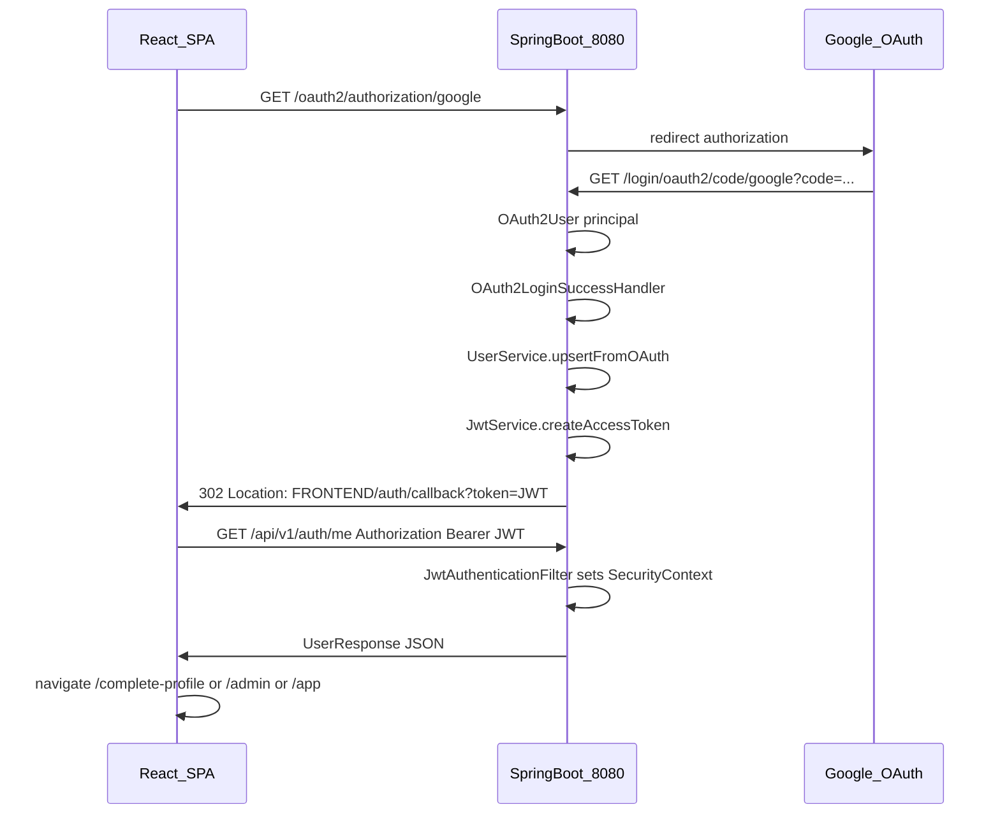

# Viva code walkthrough playbook

This document is for **oral defenses and demos** where you must tie **user-visible behaviour** to **exact files and functions**, across **frontend (React)**, **backend (Spring Boot)**, and **data (MongoDB)**. Use it as a **style guide** for how to explain any feature, and as a **worked example** for authentication (Google OAuth → JWT → protected routes).

Related technical docs (deeper reference, not viva format): [09-OAUTH_JWT_AND_ROLES.md](09-OAUTH_JWT_AND_ROLES.md), [03-BACKEND_API_RULES.md](03-BACKEND_API_RULES.md), [02-FRONTEND_UI_RULES.md](02-FRONTEND_UI_RULES.md).

---

## Technical accuracy plus plain language (required style)

Explanations in this playbook (and any notes you build from it) should **not** be jargon-only. Use them like this:

1. **Keep the technical anchors** — real file paths, class and method names, HTTP verbs and paths, Spring annotations — so you can open the IDE and prove what you say in a viva.
2. **Add a human-sized layer** — after each technical idea, add one or two sentences in **general language**: what problem this step solves, who is “holding” what (browser, Google, our server, database), and what would break if this step were missing.
3. **Optimize for retelling** — you should be able to explain the same flow to a classmate **without** reading dense terminology aloud. Pattern: *“In other words, …”* or *“So from the user’s point of view, …”* right after the precise term (e.g. “`JwtAuthenticationFilter` validates the bearer token — in other words, the server checks your wristband on every API call.”).

If a section reads like a glossary with no story, extend it until **you** understand the story well enough to teach it back.

**Optional pattern (per step or per file):**

| Voice | What to include |
|--------|-------------------|
| Technical | File, symbol, request/response, rule. |
| Plain language | Intuition, analogy, user-visible outcome. |

---

## How to explain a feature (universal rubric)

When answering “how does X work?”, follow this order so examiners can follow the thread. **For each numbered step below, be ready to add a short plain-language sentence** (see previous section), not only names and acronyms.

1. **Trigger** — What action starts it (user click, page load, timer, another service)?
2. **Frontend entry** — Route or component; which hook or handler runs first?
3. **HTTP** — Method, path, query/body; which axios instance or `fetch` (here: `frontend/src/features/core/api.js`)?
4. **Backend entry** — Controller method; path mapping (`@GetMapping`, etc.).
5. **Service layer** — Business rules, validation, orchestration.
6. **Persistence** — Repository / document model; which collection or table (Mongo collections in this project).
7. **Side effects** — Other services called (e.g. notifications after a booking change).
8. **Response** — DTO shape; what the UI does with the result (state update, redirect, toast).

Always name:

- **At least one file path** per tier (UI, API, service, data).
- **The function or method** that contains the core logic (e.g. `UserService.upsertFromOAuth`, `RequireAuth` render path).
- **A plain-language line** tying that tier to user or system behaviour (so you are never “only listing symbols”).

Optional but high impact: a **small diagram** (sequence or box) on a whiteboard or slide; one is enough per major flow.

---

## Explanation template (copy mentally for bookings, facilities, tickets, notifications)

| Layer | Questions to answer |
|--------|----------------------|
| Trigger | Who did what, when? |
| UI | Which page/component? Local state? Validation? |
| API | REST path under `/api/v1/...`? Auth header? |
| Controller | Which class/method? `@PreAuthorize`? |
| Service | Main method name? Invariants? |
| Repository | Which interface? Custom finder? |
| Model | Document/collection name? Important fields? |
| Cross-cutting | Notifications? Security? Exceptions (`GlobalExceptionHandler`)? |

---

## Repository map (where to look first)

### Frontend (`frontend/src/`)

| Path | Responsibility |
|------|----------------|
| [main.jsx](../frontend/src/main.jsx) | React mount; imports root [App.jsx](../frontend/src/App.jsx). |
| [App.jsx](../frontend/src/App.jsx) | Re-exports [features/core/App.jsx](../frontend/src/features/core/App.jsx) (all routes). |
| [features/core/App.jsx](../frontend/src/features/core/App.jsx) | **Route table**: public vs `RequireAuth` vs `RequireCompleteProfile` vs `RequireAdmin`. |
| [features/core/AuthContext.jsx](../frontend/src/features/core/AuthContext.jsx) | Session: JWT in `sessionStorage`, `GET /auth/me`, `completeLoginWithToken`. |
| [features/core/api.js](../frontend/src/features/core/api.js) | Axios instance, `Authorization` interceptor, 401 → login redirect. |
| [features/core/constants.js](../frontend/src/features/core/constants.js) | `API_ORIGIN`, `OAUTH_GOOGLE_URL`, `TOKEN_KEY`. |
| [features/core/RequireAuth.jsx](../frontend/src/features/core/RequireAuth.jsx) | `RequireAuth`, `RequireAdmin` route guards. |
| [features/core/RequireCompleteProfile.jsx](../frontend/src/features/core/RequireCompleteProfile.jsx) | Blocks `/app` and `/admin` until profile complete. |
| [features/core/AuthCallbackPage.jsx](../frontend/src/features/core/AuthCallbackPage.jsx) | Reads `?token=` after OAuth redirect. |
| [features/core/Layout.jsx](../frontend/src/features/core/Layout.jsx) | Shell, nav; mounts notification dropdown. |
| [features/auth/LoginPage.jsx](../frontend/src/features/auth/LoginPage.jsx) | Sign-in link to Google OAuth URL. |
| [features/auth/AdminUsersPage.jsx](../frontend/src/features/auth/AdminUsersPage.jsx) | Admin user listing (Member 4). |
| [features/notifications/NotificationDropdown.jsx](../frontend/src/features/notifications/NotificationDropdown.jsx) | In-app notifications (Member 4). |
| [features/facilities/](../frontend/src/features/facilities/) | Member 1 catalogue UI. |
| [features/bookings/](../frontend/src/features/bookings/) | Member 2 booking UI surfaces. |
| [features/maintenance/](../frontend/src/features/maintenance/) | Member 3 tickets / report UI. |
| [pages/](../frontend/src/pages/) | Some routed pages (e.g. MyBookings, AdminBookings). |

### Backend (`backend/src/main/java/com/smartcampus/`)

| Package | Responsibility |
|---------|----------------|
| `core.config` | [SecurityConfig.java](../backend/src/main/java/com/smartcampus/core/config/SecurityConfig.java), [CorsConfig.java](../backend/src/main/java/com/smartcampus/core/config/CorsConfig.java), [DataSeeder.java](../backend/src/main/java/com/smartcampus/core/config/DataSeeder.java) (`local` profile seeding and admin email policy). |
| `core.exception` | [GlobalExceptionHandler.java](../backend/src/main/java/com/smartcampus/core/exception/GlobalExceptionHandler.java), shared exceptions. |
| `auth` | Users, JWT, OAuth success handler, `AuthController`, `UserController`, `UserService`, security filters. |
| `notifications` | `NotificationController`, `NotificationService`, Mongo `notifications` collection. |
| `bookings` | Booking REST and service (calls notification service on events). |
| `facilities` | Resource catalogue REST and service. |
| `maintenance` | Ticket REST and service (calls notification service on events). |

### Docs (`docs/`)

| File | Use |
|------|-----|
| [05-RUNNING_AND_TEAM_INTEGRATION.md](05-RUNNING_AND_TEAM_INTEGRATION.md) | How to run, route ownership table. |
| [01-BUSINESS_AND_DATA_MODEL.md](01-BUSINESS_AND_DATA_MODEL.md) | Domain concepts and collections. |
| [06-TEAM_OWNERSHIP_AND_STATUS.md](06-TEAM_OWNERSHIP_AND_STATUS.md) | Who owns which area. |

---

## Exemplar 1 — Sign-in (Google OAuth) and session (JWT)

### One-sentence summary

The user clicks a link that hits the **Spring Boot** OAuth2 start URL; after Google returns, **`OAuth2LoginSuccessHandler`** upserts the user in MongoDB, mints a **JWT**, redirects the browser to the SPA **`/auth/callback?token=`**; the SPA stores the token and calls **`GET /api/v1/auth/me`** with **`Authorization: Bearer`**; route guards use **`AuthContext`**’s `user` to protect `/app` and `/admin`.

**Plain language (rehearsal line):** Google proves who you are; our server then creates or updates your campus user record, gives your browser a signed **pass** (the JWT) that fits in storage, and from then on the browser shows that pass on every API call. The React app only unlocks staff or student pages once it has successfully asked the server “who am I?” and got a real profile back.

The subsections below stay technical for precision; when you present them, **add your own “in other words”** after each bullet block so listeners who are not reading the code still follow.

### Sequence diagram



### Demo script (which file to open while talking)

1. [LoginPage.jsx](../frontend/src/features/auth/LoginPage.jsx) — show the anchor `href={OAUTH_GOOGLE_URL}`.
2. [constants.js](../frontend/src/features/core/constants.js) — show `OAUTH_GOOGLE_URL` pointing at backend, not a React route.
3. [OAuth2LoginSuccessHandler.java](../backend/src/main/java/com/smartcampus/auth/security/OAuth2LoginSuccessHandler.java) — `onAuthenticationSuccess`: email, upsert, JWT, redirect.
4. [AuthCallbackPage.jsx](../frontend/src/features/core/AuthCallbackPage.jsx) — `token` query param and `navigate`.
5. [AuthContext.jsx](../frontend/src/features/core/AuthContext.jsx) — `completeLoginWithToken` and `loadMe`.
6. [App.jsx](../frontend/src/features/core/App.jsx) — nested `RequireAuth` / `RequireCompleteProfile` / `RequireAdmin`.

---

### Frontend — files and functions

#### 1. OAuth start URL

**File:** [frontend/src/features/core/constants.js](../frontend/src/features/core/constants.js)

- `API_ORIGIN` — base URL for Spring (default `http://localhost:8080`; override with `VITE_API_ORIGIN`).
- `OAUTH_GOOGLE_URL` — `${API_ORIGIN}/oauth2/authorization/google` (standard Spring Security OAuth2 authorization endpoint).

#### 2. Login page

**File:** [frontend/src/features/auth/LoginPage.jsx](../frontend/src/features/auth/LoginPage.jsx)

- Default export `LoginPage`.
- **`<a href={OAUTH_GOOGLE_URL}>`** — full page navigation to the **backend**; this is not handled by React Router.
- **`useEffect`** — if `useAuth()` already has `user` (e.g. returning visitor with valid token), **`navigate`** to `/complete-profile` or `/admin` or `/app` depending on `profileCompleted` and `role` (same destination rules as callback).

#### 3. Application bootstrap and routes

**File:** [frontend/src/main.jsx](../frontend/src/main.jsx) — mounts React and imports root `App`.

**File:** [frontend/src/App.jsx](../frontend/src/App.jsx) — re-exports `./features/core/App.jsx`.

**File:** [frontend/src/features/core/App.jsx](../frontend/src/features/core/App.jsx)

- Wraps everything in **`BrowserRouter`** and **`AuthProvider`** (session available to all descendants).
- **Public routes** (inside `Layout`): `/`, `/login`, `/auth/callback`, `/docs`.
- **Protected tree:** `<Route element={<RequireAuth />}>` wraps:
  - `/complete-profile` → `ProfileSetupPage`
  - Nested `<Route element={<RequireCompleteProfile />}>` containing:
    - `/app/*` — student portal (`Outlet` + child routes).
    - `/admin/*` — `<Route element={<RequireAdmin />}>` staff portal.

Key lines (route structure):

```32:59:frontend/src/features/core/App.jsx
          <Route element={<Layout />}>
            <Route path="/" element={<HomePage />} />
            <Route path="login" element={<LoginPage />} />
            <Route path="auth/callback" element={<AuthCallbackPage />} />
            <Route path="docs" element={<ReadmeViewer />} />

            <Route element={<RequireAuth />}>
              <Route path="complete-profile" element={<ProfileSetupPage />} />
              <Route element={<RequireCompleteProfile />}>
                <Route path="app" element={<Outlet />}>
                  <Route index element={<UserDashboardPage />} />
                  <Route path="resources" element={<ResourceCatalogPage />} />
                  <Route path="bookings" element={<MyBookings />} />
                  <Route path="report" element={<TicketsPage />} />
                  <Route path="account" element={<UserAccountPage />} />
                  <Route path="*" element={<NotFoundPage />} />
                </Route>

                <Route path="admin" element={<RequireAdmin />}>
                  <Route index element={<AdminDashboardPage />} />
                  <Route path="resources" element={<ResourceCatalogPage />} />
                  <Route path="bookings" element={<AdminBookings />} />
                  <Route path="incidents" element={<TicketsPage />} />
                  <Route path="users" element={<AdminUsersPage />} />
                  <Route path="*" element={<NotFoundPage />} />
                </Route>
              </Route>
            </Route>
```

#### 4. OAuth return — token in URL

**File:** [frontend/src/features/core/AuthCallbackPage.jsx](../frontend/src/features/core/AuthCallbackPage.jsx)

- **`useSearchParams()`** — reads `token` from query string.
- **`completeLoginWithToken(token)`** from `useAuth()` — persists token and loads user (see below).
- **`.then((me) => …)`** — `navigate('/complete-profile')` if `me.profileCompleted !== true`, else `navigate(me.role === 'ADMIN' ? '/admin' : '/app')`.
- On missing token or API failure — error UI and link back to `/login`.

#### 5. Session state and “who am I”

**File:** [frontend/src/features/core/AuthContext.jsx](../frontend/src/features/core/AuthContext.jsx)

- **`AuthProvider`** — holds React state: `user`, `loading`.
- **`loadMe`** — if no `sessionStorage` token (`TOKEN_KEY` from constants), clears user; else **`api.get('/auth/me')`** and sets `user` from JSON. Runs on mount via `useEffect`.
- **`completeLoginWithToken(token)`** — `sessionStorage.setItem(TOKEN_KEY, token)`, then **`api.get('/auth/me')`**, sets `user`, returns that data for callback navigation.
- **`logout`** — removes token and clears `user`.
- **`useMemo` value** — exposes `user`, `loading`, `isAuthenticated`, `isAdmin`, `currentUserId`, `logout`, `refreshSession`, `completeLoginWithToken`, `apiOrigin`.

#### 6. Attaching JWT to every API call

**File:** [frontend/src/features/core/api.js](../frontend/src/features/core/api.js)

- **`axios.create`** — `baseURL` from `VITE_API_BASE_URL` or `${API_ORIGIN}/api/v1`.
- **Request interceptor** — reads token from `sessionStorage`; if present, sets **`config.headers.Authorization = 'Bearer ' + token`**.
- **Response interceptor** — on **401**, removes token and **`window.location.assign('/login')`** unless path is `/`, `/login`, or `/auth/callback` (avoids redirect loops during login flow).

---

### Backend — files and functions

#### 1. Security filter chain and URL rules

**File:** [backend/src/main/java/com/smartcampus/core/config/SecurityConfig.java](../backend/src/main/java/com/smartcampus/core/config/SecurityConfig.java)

- **`securityFilterChain`** bean wires:
  - **`JwtAuthenticationFilter`** added **before** `UsernamePasswordAuthenticationFilter` — JWT parsed on every request (except early returns inside the filter for OAuth paths).
  - **`authorizeHttpRequests`**: `permitAll` for `/oauth2/**`, `/login/oauth2/**`, `/error`, `OPTIONS /**`, and **`/api/v1/auth/dev-login`** (used only with `local` profile controller).
  - **`/api/v1/**`** — **`authenticated()`** (JWT or OAuth session depending on request; after OAuth redirect the app uses JWT for API calls).
  - **`oauth2Login`** — **`successHandler(oauth2LoginSuccessHandler)`** custom redirect with token.
  - **`exceptionHandling`** — JSON-friendly 401/403 for `/api/v1/**`.

#### 2. After Google authenticates

**File:** [backend/src/main/java/com/smartcampus/auth/security/OAuth2LoginSuccessHandler.java](../backend/src/main/java/com/smartcampus/auth/security/OAuth2LoginSuccessHandler.java)

- Extends `SimpleUrlAuthenticationSuccessHandler`.
- **`onAuthenticationSuccess`**:
  - Casts `authentication.getPrincipal()` to **`OAuth2User`**.
  - Reads **`email`** (required), **`name`**, **`sub`** (Google subject).
  - **`userService.upsertFromOAuth(email, name, sub)`** — load or create Mongo user.
  - **`jwtService.createAccessToken(user)`** — signed JWT.
  - Builds redirect: **`app.frontend.url`** + `/auth/callback?token=` + URL-encoded token.
  - Invalidates servlet session (OAuth dance finished; API session is JWT in SPA).

#### 3. User record from OAuth

**File:** [backend/src/main/java/com/smartcampus/auth/UserService.java](../backend/src/main/java/com/smartcampus/auth/UserService.java)

- **`upsertFromOAuth(String email, String name, String oauthProviderId)`**:
  - If user exists (by email, case-insensitive): update `name` / `oauthProviderId` if changed; save if needed.
  - Else **insert** new user: default **`RoleType.USER`**, **`profileCompleted(false)`**, **`UserType.UNASSIGNED`**, etc.

Admin **role** for real users is **not** chosen inside `upsertFromOAuth`. With the **`local`** profile, **[DataSeeder.java](../backend/src/main/java/com/smartcampus/core/config/DataSeeder.java)** runs **`enforceRolePolicy`**: emails listed in **`app.auth.admin-emails`** in [application.properties](../backend/src/main/resources/application.properties) get **`RoleType.ADMIN`**; others **`USER`**. It can also create placeholder admin users for configured emails if missing (`ensureConfiguredAdminsExist`).

#### 4. JWT creation and validation

**File:** [backend/src/main/java/com/smartcampus/auth/security/JwtService.java](../backend/src/main/java/com/smartcampus/auth/security/JwtService.java)

- **`createAccessToken(User user)`** — JWT **subject** = Mongo **`user.getId()`**; claims **`email`**, **`role`**; signed with **`app.jwt.secret`** (HS256; secret must be ≥ 32 chars — enforced in constructor).
- **`parseAndValidate(String token)`** — verifies signature and expiry; returns **`JwtPrincipal`**.

**File:** [backend/src/main/java/com/smartcampus/auth/security/JwtPrincipal.java](../backend/src/main/java/com/smartcampus/auth/security/JwtPrincipal.java)

- Implements Spring **`UserDetails`**; **`getAuthorities()`** returns `ROLE_USER` or `ROLE_ADMIN` from JWT claim (used by `@PreAuthorize("hasRole('ADMIN')")` style checks).

#### 5. JWT on each API request

**File:** [backend/src/main/java/com/smartcampus/auth/security/JwtAuthenticationFilter.java](../backend/src/main/java/com/smartcampus/auth/security/JwtAuthenticationFilter.java)

- **`doFilterInternal`** — if path starts with `/oauth2` or `/login/oauth2`, passes through without JWT processing.
- If **`Authorization: Bearer`** present: **`jwtService.parseAndValidate(token)`** → builds **`UsernamePasswordAuthenticationToken`** with **`JwtPrincipal`** → **`SecurityContextHolder.getContext().setAuthentication(...)`**.
- Invalid/expired token: catch and leave anonymous; protected endpoints then return **401**.

#### 6. Current user endpoint

**File:** [backend/src/main/java/com/smartcampus/auth/web/AuthController.java](../backend/src/main/java/com/smartcampus/auth/web/AuthController.java)

- **`GET /api/v1/auth/me`** — argument **`@AuthenticationPrincipal JwtPrincipal principal`**; returns **`userService.getById(principal.getUserId())`** as **`UserResponse`** (includes `role`, `profileCompleted`, profile fields).

#### 7. Configuration

**File:** [backend/src/main/resources/application.properties](../backend/src/main/resources/application.properties)

- **`app.jwt.secret`**, **`app.jwt.expiration-ms`**, **`app.frontend.url`** (must match Vite origin for OAuth callback redirect).
- **`spring.security.oauth2.client.registration.google.*`** — client id/secret, scopes `openid,profile,email`, redirect **`{baseUrl}/login/oauth2/code/{registrationId}`** (Google sends the browser back to Spring on this path).

---

### Optional: local development without Google

**File:** [backend/src/main/java/com/smartcampus/auth/web/DevAuthController.java](../backend/src/main/java/com/smartcampus/auth/web/DevAuthController.java)

- Annotated **`@Profile("local")`** — bean exists only when running with `local` profile.
- **`GET /api/v1/auth/dev-login?as=user|admin`** — returns **`AuthTokenResponse`** with JWT for seeded or first admin user (see `SecurityConfig` `permitAll` for this path).

Use this only to explain **local** demos; the production story is Google OAuth above.

---

## Exemplar 1 (continued) — Protected routes and two layers of “protection”

### Layer A — React Router (what pages you see)

Guards are **components** that render **`<Outlet />`** (children) or **`<Navigate />`** (redirect).

| Guard | File | Behaviour |
|-------|------|-----------|
| `RequireAuth` | [RequireAuth.jsx](../frontend/src/features/core/RequireAuth.jsx) | While `loading`, show loading text. If **`!user`**, redirect to **`/login`** with `state.from` preserved. Else render **`<Outlet />`** (child routes). |
| `RequireCompleteProfile` | [RequireCompleteProfile.jsx](../frontend/src/features/core/RequireCompleteProfile.jsx) | If no user → login. If **`user.profileCompleted !== true`** → **`/complete-profile`**. Else **`<Outlet />`** so `/app` and `/admin` trees are reachable. |
| `RequireAdmin` | [RequireAuth.jsx](../frontend/src/features/core/RequireAuth.jsx) | Same loading/unauthenticated handling; if **`user.role !== 'ADMIN'`**, redirect to **`/app`**. Else **`<Outlet />`**. |

**What “logged in” means in the SPA:** `AuthContext` has a non-null **`user`** object returned from **`GET /api/v1/auth/me`** using a valid stored JWT — not merely having visited `/auth/callback`.

### Layer B — Spring Security (whether API returns data)

- **`SecurityConfig`** requires authentication for **`/api/v1/**`** (except explicitly permitted paths).
- Controllers use **`@AuthenticationPrincipal JwtPrincipal`** for per-user identity and **`@PreAuthorize`** on sensitive operations (e.g. admin-only user list on `UserController`).

If someone bypasses the UI and calls the API without a valid JWT, they get **401** regardless of React guards.

---

## Further exemplars (same depth, add when preparing)

Use the **universal rubric** and **template** above, and apply the **technical + plain language** style in [Technical accuracy plus plain language](#technical-accuracy-plus-plain-language-required-style), to author parallel sections (or separate docs) for:

- **User CRUD / profile** — `UserController`, `UserService`, `ProfileSetupPage`, `UserAccountPage`, `AdminUsersPage`.
- **Notifications** — `NotificationService.create` / `notifyAdmins`, who calls them from `BookingService` / `TicketService`, `NotificationController`, `NotificationDropdown`.
- **Bookings / facilities / maintenance** — each domain’s controller → service → repository → UI page.

Keeping this file’s **first exemplar** (auth) complete is enough for a strong Member 4 narrative; extend the same pattern for other members’ areas when you need full marks on cross-cutting behaviour.
